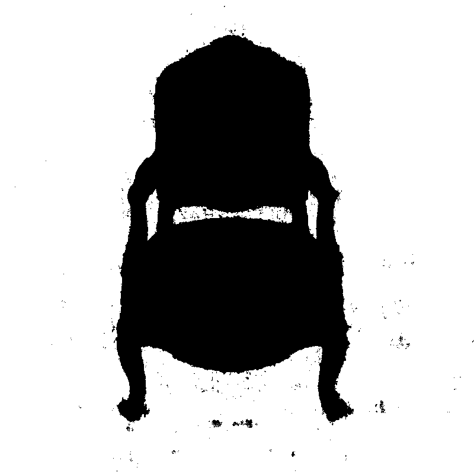
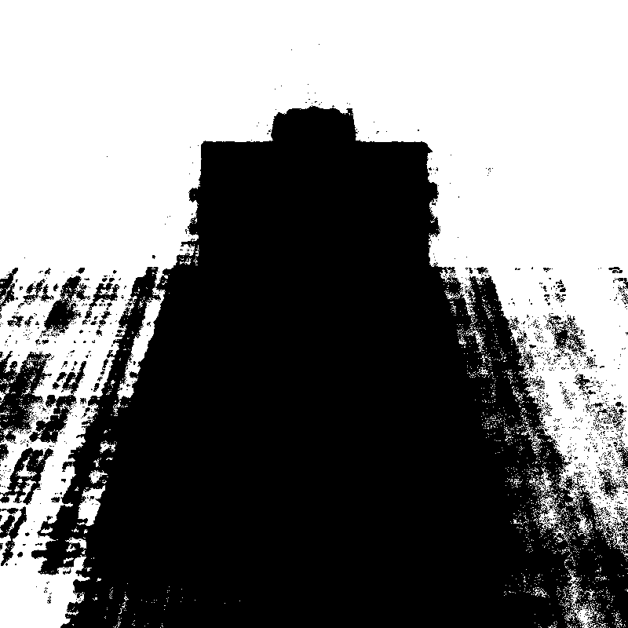
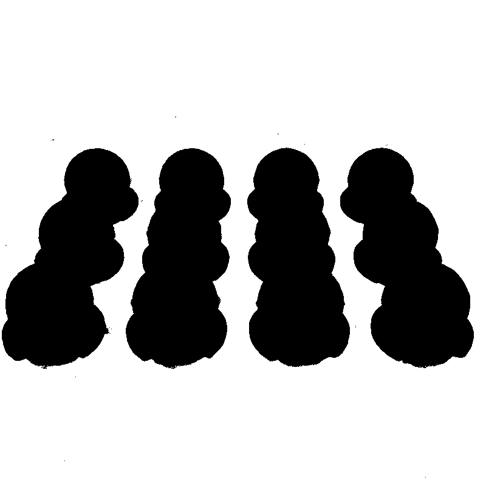
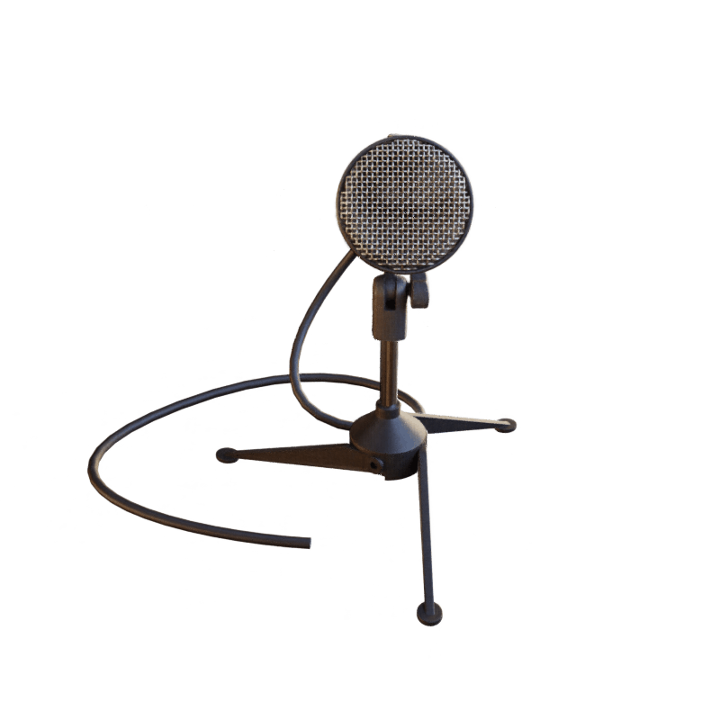
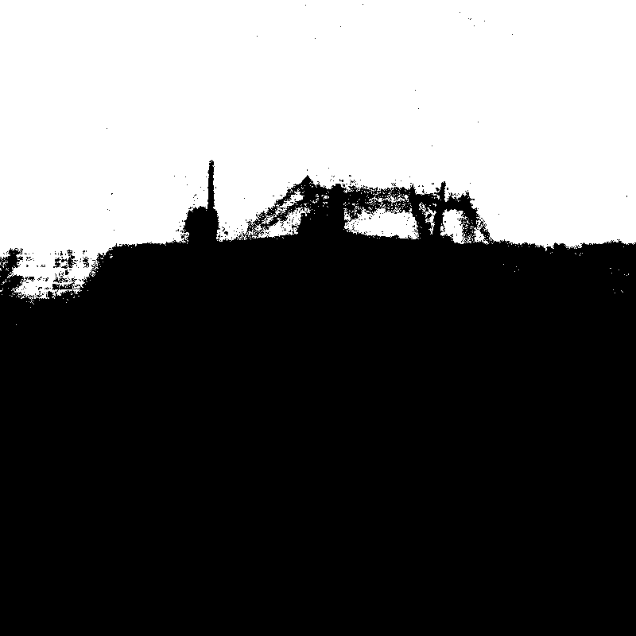

# NeRF in Pytorch

Pytorch Re-Implementation of [NeRF](http://www.matthewtancik.com/nerf) (Neural Radiance Fields)

Paper : https://arxiv.org/abs/2003.08934

---

# Preparation

## Environment

```
conda env create -f environment.yml
conda activate nerf
```

---

## Dataset

Download data for two example datasets: `lego` and `fern`

```
bash download_data.sh
```

Download more dataset from link below
https://drive.google.com/drive/folders/128yBriW1IG_3NJ5Rp7APSTZsJqdJdfc1

synthetic 8 datasets : [chair, drums, ficus, hotdog, lego, materials, mic, ship]

## Data Directory

```
root
|-- nerf_synthetic
      |-- lego
            |-- train
               |-- r_0.png
               |-- r_1.png
                     ...
               |-- r_99.png
            |-- test
            |-- val
            |-- transforms_train.json
            |-- transforms_test.json
            |-- transforms_val.json
      |-- fern
      ...
|-- nerf_llff_data
|-- nerf_real_360
```

---

# Experiments

## Training

1. change DATA_NAME in 'config.py' to train various datas.

   [chair, drums, ficus, hotdog, lego, materials, mic, ship]

2. set data root in 'configs/.yaml file' 'data > root'

3. you can set chunk_ray & chunk_pts for cuda memory (batchify)

```
python train.py
```

## Testing

```
python test.py
```

if Test, set configs/.yaml mode_test = TRUE

if Render, set configs/.yaml mode_render = TRUE

# Results

## • Official Paper Results

| data      | model           | Batch rays | resolution    | PSNR      | SSIM      | LPIPS     |
| --------- | --------------- | ---------- | ------------- | --------- | --------- | --------- |
| chair     | Coarse+Fine     | 4096       | 800 x 800     | 33.00     | 0.967     | 0.046     |
| drums     | Coarse+Fine     | 4096       | 800 x 800     | 25.01     | 0.925     | 0.091     |
| ficus     | Coarse+Fine     | 4096       | 800 x 800     | 30.13     | 0.964     | 0.044     |
| hotdog    | Coarse+Fine     | 4096       | 800 x 800     | 36.18     | 0.974     | 0.121     |
| lego      | Coarse+Fine     | 4096       | 800 x 800     | 32.54     | 0.961     | 0.050     |
| materials | Coarse+Fine     | 4096       | 800 x 800     | 29.62     | 0.949     | 0.063     |
| mic       | Coarse+Fine     | 4096       | 800 x 800     | 32.91     | 0.980     | 0.028     |
| ship      | Coarse+Fine     | 4096       | 800 x 800     | 28.65     | 0.856     | 0.206     |
| **mean**  | **Coarse+Fine** | **4096**   | **800 x 800** | **31.01** | **0.947** | **0.081** |

## • This Repo Results

| data      | model           | Batch rays | resolution    | PSNR      | SSIM      | LPIPS     |
| --------- | --------------- | ---------- | ------------- | --------- | --------- | --------- |
| chair     | Coarse+Fine     | 4096       | 800 x 800     | 33.29     | 0.969     | 0.034     |
| drums     | Coarse+Fine     | 4096       | 800 x 800     | 24.98     | 0.923     | 0.083     |
| ficus     | Coarse+Fine     | 4096       | 800 x 800     | 29.87     | 0.961     | 0.050     |
| hotdog    | Coarse+Fine     | 4096       | 800 x 800     | 37.51     | 0.976     | 0.034     |
| lego      | Coarse+Fine     | 4096       | 800 x 800     | 32.44     | 0.961     | 0.045     |
| materials | Coarse+Fine     | 4096       | 800 x 800     | 29.54     | 0.944     | 0.063     |
| mic       | Coarse+Fine     | 4096       | 800 x 800     | 33.55     | 0.983     | 0.019     |
| ship      | Coarse+Fine     | 4096       | 800 x 800     | 28.64     | 0.859     | 0.163     |
| **mean**  | **Coarse+Fine** | **4096**   | **800 x 800** | **31.23** | **0.947** | **0.061** |

**TEST RESULT** of 200 images from Test Dataset

SSIM code from https://github.com/dingkeyan93/IQA-optimization

LPIPS from https://pypi.org/project/lpips/

## Train Environment

```
ubuntu 20.04
GeForce RTX 3090
cuda : v11.1
cuDNN : v8.0.5
```

## • Render Results

<table>
      <thead>
      <tr>
            <th width="500px">Render RGB</th>
            <th width="500px">Render DISP</th>
      </tr>
      </thead>
      <tbody>
            <tr width="500px">
                  <td></td>
                  <td></td>
            </tr>
            <tr width="500px">
                  <td></td>
                  <td></td>
            </tr>
            <tr width="500px">
                  <td></td>
                  <td></td>
            </tr>
            <tr width="500px">
                  <td></td>
                  <td></td>
            </tr>
            <tr width="500px">
                  <td></td>
                  <td></td>
            </tr>
            <tr width="500px">
                  <td></td>
                  <td></td>
            </tr>
            <tr width="500px">
                  <td></td>
                  <td></td>
            </tr>
            <tr width="500px">
                  <td></td>
                  <td></td>
            </tr>
      </tbody>
</table>
